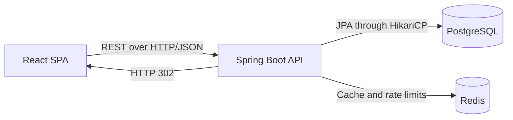

# Brevly URL Shortener — Improvement Roadmap

A full-stack URL shortener built with React, Spring Boot, PostgreSQL, and Redis. The application supports authentication, short-link creation, expiration, redirects, click analytics, QR codes, and per-user link management.

> Current status: working portfolio project under active improvement. It is a modular monolith, not a microservices system and not yet production-ready.

## Current Architecture



### Frontend
- React 19 and Vite
- React Router, Axios, Recharts, QR code generation
- JWT stored in HttpOnly, SameSite=Strict cookie (XSS-safe)

### Backend
- Java 21 and Spring Boot 3.3.5
- Spring Security and JWT (cookie-based, HttpOnly)
- Spring Data JPA/Hibernate with HikariCP
- PostgreSQL, Spring Data Redis/Lettuce
- Scheduled batched analytics writes
- Redis-based rate limiting (10 req/60s on /api/shorten)

---

## Existing Features

- [x] User registration and login
- [x] JWT-protected routes (HttpOnly cookie, SameSite=Strict)
- [x] Anonymous and authenticated URL shortening
- [x] Base62 short-code generation
- [x] Optional URL expiration
- [x] HTTP 302 redirection
- [x] Per-user dashboard and URL deletion
- [x] Daily click analytics and QR-code generation
- [x] Redis-based rate limiting
- [x] Docker files
- [x] Backend unit + integration tests (31 passing)

---

## Completed Improvements

### P0 — Security and Correctness (DONE)

- [x] Persistent JWT secret (reads JWT_SECRET from env config via @Value)
- [x] Ownership authorization (403 Forbidden for unauthorized access)
- [x] Safe error responses (GlobalExceptionHandler, no stack traces to client)
- [x] Input validation (@NotBlank, email, password rules, @Valid on all requests)
- [x] Expiry validation (rejects zero or negative expiryDays)
- [x] Database constraints (username, email, short code unique; NOT NULL enforced)
- [x] Secure token storage (JWT in HttpOnly, Secure, SameSite=Strict cookie; logout clears cookie)
- [x] CSRF protection (Double-Submit Cookie Pattern using CookieCsrfTokenRepository and axios interceptor)

### P1 — Redis and Redirect Correctness (DONE)

- [x] Fixed Spring cache proxy self-invocation (moved @Cacheable/@CacheEvict to dedicated UrlCacheService bean)
- [x] Eliminated second URL lookup (CachedUrlData DTO cached in Redis; zero DB queries on cache hit)
- [x] Cache eviction on delete (UrlController.deleteUrl calls evictCache immediately after DB deletion)
- [x] Cache eviction on expiry (expired links proactively evict cache and throw UrlExpiredException)
- [x] Redis resilience (CacheErrorHandler logs errors and falls back to PostgreSQL; no HTTP 500 on Redis outage)
- [x] Cache integration tests (cache miss, hit, delete eviction, expiry eviction; uses spring.cache.type=simple, no live Redis needed in CI)

---

## Pending Work

### P1 — Auth Improvements

- [ ] Refresh token mechanism (Access Token 15 min + Refresh Token 7 days opaque UUID hashed in DB; rotation on every refresh)

### P1 — Analytics Reliability

- [ ] Document possible data loss (in-memory clicks lost on crash/deploy)
- [ ] Make flushing failure-safe (do not remove events before DB write confirmed)
- [ ] Include pending in-memory clicks in analytics responses or document 2-second delay

### P1 — Database and Concurrency

- [ ] Add indexes for short_url, user_id, created_date, and analytics queries
- [ ] Replace ddl-auto=update with Flyway migrations
- [ ] Configure and document HikariCP pool size and timeouts
- [ ] Add pagination to user URL list and analytics event queries

### P2 — Frontend Quality

- [ ] Fix all ESLint errors and React Hook dependency warnings
- [ ] Add route-level code splitting
- [ ] Add accessible labels, keyboard navigation, focus states
- [ ] Add loading, empty, offline, rate-limit, and server-error states consistently
- [ ] Add frontend tests for auth, shortening, deletion, and analytics
- [ ] Remove or implement non-working GitHub login and forgot-password controls

### P2 — Configuration and Deployment

- [ ] Validate all required environment variables during startup
- [ ] Separate local, test, and production configuration clearly
- [ ] Add health and readiness endpoints using Spring Boot Actuator
- [ ] Add graceful shutdown so pending requests and analytics events are handled safely

---

## SDE-1 Improvement Plan for 2026

### Phase 1 — Make the Current Application Trustworthy (Mostly Complete)

- [x] Persistent JWT secret
- [x] Ownership authorization
- [x] Request validation and safe errors
- [x] Database constraints
- [x] Working Redis cache and eviction (proxy fix, DTO caching, eviction on delete/expiry)
- [x] Redis resilience (CacheErrorHandler graceful degradation)
- [x] Cache integration tests (31 backend tests passing)
- [x] CSRF protection
- [ ] Fix frontend lint

### Phase 2 — Improve Reliability and Maintainability (Estimated 20-30 hours)

- [ ] Flyway migrations, database indexes, pagination
- [ ] Refresh token authentication
- [ ] Actuator health checks and metrics
- [ ] Environment variable validation on startup
- [ ] Graceful shutdown and HikariCP configuration
- [ ] Structured logging with request/correlation IDs
- [ ] CI workflow

### Phase 3 — Demonstrate Performance Knowledge (Estimated 15-25 hours)

- [ ] k6 or Gatling load tests for shortening and redirects
- [ ] Measure cache-hit and cache-miss latency
- [ ] Document results and bottlenecks

### Phase 4 — Add One Distributed Component (Optional, 30-50 hours)

- [ ] Two backend instances behind a load balancer
- [ ] Replace in-memory analytics with Redis Streams or Kafka
- [ ] Separate analytics worker/consumer

---

## Recommended Additional Features

### Strong Portfolio Additions

- [ ] Custom aliases with collision and reserved-word validation
- [ ] Duplicate URL detection
- [ ] Link disable/enable controls
- [ ] Password reset and email verification
- [ ] API keys for programmatic link creation
- [ ] Swagger / OpenAPI documentation
- [ ] Link-level geographic/device/referrer analytics
- [ ] Bulk URL creation and CSV export
- [ ] Admin dashboard and audit log

---

## Testing Checklist

### Backend
- [x] Registration and login success/failure
- [x] JWT validation and expiry behavior
- [x] Ownership authorization (403 Forbidden)
- [x] URL validation and expiry validation
- [x] Redirect success, missing link, expired link
- [x] Redis cache hit, miss, eviction (integration tested)
- [ ] Rate-limit boundary and Redis outage
- [ ] Analytics batching, retry, and duplicate handling
- [ ] Repository integration tests against PostgreSQL (Testcontainers)

### Frontend
- [ ] Authentication flows, protected route behavior
- [ ] URL shortening and validation, rate-limit error UI
- [ ] Dashboard loading and deletion, analytics date-range switching
- [ ] Accessibility checks

### Operational
- [ ] Fresh Docker startup, database migration from older schema
- [ ] PostgreSQL unavailable, Redis unavailable
- [ ] Graceful shutdown under traffic

---

## Local Development

### Requirements
- Java 21, Node.js 18+, Maven, PostgreSQL, Redis

### Backend
```powershell
cd url-shortener-sb
mvn.cmd test
mvn.cmd spring-boot:run
```
Backend runs at http://localhost:8080

### Frontend
```powershell
cd url-shortener-ui
npm install
npm run dev
```
Frontend runs at http://localhost:5173

---

## Current Verification Status

- Backend tests: **31 passing** (27 unit + 4 cache integration tests)
- Frontend production build: passing
- Frontend lint: failing with ESLint errors
- Redis cache: fully functional (proxy fix, DTO caching, eviction on delete/expiry, graceful degradation on Redis failure)
- Architecture: modular monolith

---

## Portfolio Completion Criteria

This project is ready to present as a strong SDE-1 portfolio project when:

- [ ] All P0 and P1 items are complete
- [ ] Backend tests, frontend tests, lint, and builds pass in CI
- [ ] Deployment is publicly accessible and reproducible
- [ ] Security and ownership behavior are demonstrated by tests
- [ ] Performance claims include reproducible measurements
- [ ] Architecture decisions and trade-offs are documented
- [ ] You can explain every major component without depending on generated text

For an SDE-1 project, completing Phases 1-3 is sufficient. Phase 4 is an optional differentiator.
