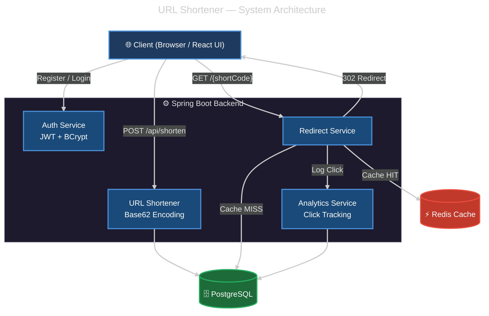
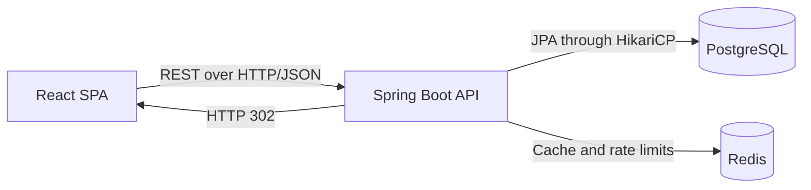
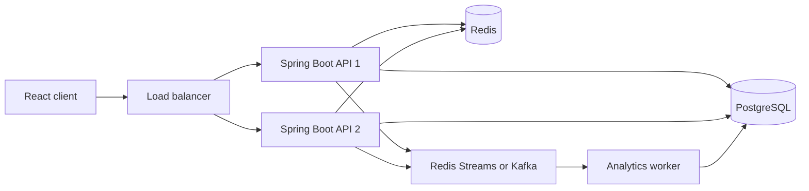

<<<<<<< ours
# 🚀 URL-Shortener

A production-ready full-stack URL shortener built with **React (Vite)**, **Spring Boot**, **PostgreSQL**, and **Redis**. It features JWT-based authentication, click analytics, and high-performance redirect routing powered by mathematically efficient Base62 encoding.

## 🏗️ System Architecture

When a user visits a short URL, the request is instantly handled by a multi-layer cache and persistent storage routing system:



### 🧠 The Math Behind the Magic: Base62 Encoding
How does a database row become a highly compact short URL without collision?
1. Every new URL mapped in PostgreSQL is assigned an auto-incremented Row ID (e.g., `125`, `3,521,614,606,208`).
2. That Base-10 integer is transformed into a **Base-62** string utilizing 62 characters (`0-9`, `a-z`, `A-Z`).
3. The result is completely deterministic, URL-safe, compact, and immune to string-clashing.

---

## 💻 Tech Stack

### Backend
* **Java 17 & Spring Boot 3**: Reliable, type-safe API controllers
* **PostgreSQL**: Relational persistent storage
* **Redis**: Sub-millisecond lookup cache preventing database bottleneck
* **Spring Security & JWT**: Request authorization and session management

### Frontend
* **React + Vite**: Ultra-fast component rendering and developer HMR
* **Tailwind CSS**: Utility-first scalable aesthetic design
* **Axios**: Network interfacing

---

## 🚀 How to Run Locally

### Prerequisites
* [Java 17+](https://adoptium.net/)
* [Node.js 18+](https://nodejs.org/)
* [PostgreSQL](https://www.postgresql.org/) (Running on `localhost:5432`)
* [Redis](https://redis.io/) (Running on `localhost:6379`)

### 1. Database Setup
Create an empty PostgreSQL database named `url_shortener`.

### 2. Backend Setup
Navigate into your Spring Boot application folder:
```bash
cd url-shortener-sb
```

Set up your local environment variables (or modify `src/main/resources/application.properties`):
```env
DATABASE_URL=jdbc:postgresql://localhost:5432/url_shortener
DATABASE_USERNAME=postgres
DATABASE_PASSWORD=your_postgres_password
REDIS_HOST=localhost
REDIS_PORT=6379
REDIS_PASSWORD=your_redis_password
```

Compile and run the Spring Boot API:
```bash
./mvnw clean install
./mvnw spring-boot:run
```
*(The backend runs on `http://localhost:8080`)*

### 3. Frontend Setup
Navigate into your React UI folder:
```bash
cd url-shortener-ui
```

Make sure your UI knows where your backend is. In `.env.development`:
```env
VITE_BACKEND_URL=http://localhost:8080
```

Install modules and start Vite:
```bash
npm install
npm run dev
```
*(The frontend runs on `http://localhost:5173`)*

---

*Built for high performance and learning in public.*
=======
# Brevly URL Shortener — Improvement Roadmap

A full-stack URL shortener built with React, Spring Boot, PostgreSQL, and Redis. The application supports authentication, short-link creation, expiration, redirects, click analytics, QR codes, and per-user link management.

> Current status: working portfolio project under improvement. It is a modular monolith, not a microservices system and not yet production-ready.

## Current architecture



### Frontend

- React 19 and Vite
- React Router
- Axios
- Recharts
- QR code generation
- JWT stored in browser local storage

### Backend

- Java 21 and Spring Boot 3.3.5
- Spring MVC REST API
- Spring Security and JWT
- Spring Data JPA/Hibernate
- HikariCP database connection pool
- PostgreSQL
- Spring Data Redis/Lettuce
- Scheduled batched analytics writes

## Existing features

- [x] User registration and login
- [x] JWT-protected routes
- [x] Anonymous and authenticated URL shortening
- [x] Base62 short-code generation
- [x] Optional URL expiration
- [x] HTTP 302 redirection
- [x] Per-user dashboard
- [x] Delete URL
- [x] Daily click analytics
- [x] QR-code generation
- [x] Redis-based rate limiting
- [x] Docker files
- [x] Backend unit tests

## Important problems to fix

### P0 — Security and correctness

- [ ] **Use a persistent JWT secret.** `JwtUtil` currently generates a new signing key during every startup. Read `JWT_SECRET` from configuration so tokens survive restarts and work across multiple instances.
- [ ] **Enforce resource ownership.** Only the owner of a short URL should be able to read its analytics or delete it. Return `403 Forbidden` when another user attempts either operation.
- [ ] **Remove stack traces from API responses.** Log exceptions on the server and return a safe error code and message to the client.
- [ ] **Validate authentication input.** Add `@NotBlank`, email validation, password rules, length limits, and `@Valid` to registration and login requests.
- [ ] **Validate expiration.** Reject zero or negative `expiryDays` and set a reasonable maximum.
- [ ] **Add database constraints.** Make username, email, and short code unique. Add required `NOT NULL` constraints.
- [ ] **Review token storage.** At minimum add a strict Content Security Policy. For stronger browser security, consider secure `HttpOnly`, `SameSite` cookies.

### P1 — Redis and redirect correctness

- [ ] **Fix Spring cache proxy usage.** The `@Cacheable` method is called from another method in the same service, which can bypass Spring's caching proxy. Move the cached lookup into a separate service.
- [ ] **Avoid the second URL lookup.** The redirect path currently queries PostgreSQL again for expiration and analytics data, reducing the value of Redis. Cache a safe redirect DTO containing the mapping ID, original URL, and expiration.
- [ ] **Evict cached URLs after deletion.** Use `@CacheEvict` or explicit cache removal.
- [ ] **Define cache behavior after URL updates and expiry.** Expired or deleted links must never remain usable because of stale cache entries.
- [ ] **Test cache hits, misses, eviction, expiry, and Redis failure.**

### P1 — Analytics reliability

- [ ] **Document possible data loss.** Clicks are temporarily held in application memory and can be lost during crashes or deployments.
- [ ] **Make flushing failure-safe.** Do not remove counters/events permanently before confirming that the database write succeeded.
- [ ] **Include pending in-memory clicks in analytics responses**, or clearly document the two-second reporting delay.
- [ ] **Choose a scaling design.** Keep direct/batched database writes for the monolith, or use a durable queue such as Redis Streams or Kafka when adding multiple backend instances.
- [ ] **Add idempotent event processing** so retries do not count one click twice.

### P1 — Database and concurrency

- [ ] Add indexes for `short_url`, `user_id`, `created_date`, and click-event analytics queries.
- [ ] Replace `ddl-auto=update` in production with Flyway migrations.
- [ ] Verify concurrent short-link creation and unique-code behavior.
- [ ] Verify atomic click-count updates under concurrency.
- [ ] Configure and document HikariCP pool size, timeouts, and expected database limits.
- [ ] Add pagination to the user URL list and analytics event queries.

### P2 — Frontend quality

- [ ] Fix all ESLint errors and React Hook dependency warnings.
- [ ] Add route-level code splitting; the current production JavaScript bundle is large.
- [ ] Remove the inaccurate “last updated live” text unless polling, SSE, or WebSockets are implemented.
- [ ] Add accessible labels, keyboard navigation, focus states, and screen-reader feedback.
- [ ] Add loading, empty, offline, rate-limit, and server-error states consistently.
- [ ] Add frontend tests for authentication, shortening, deletion, and analytics.
- [ ] Remove or implement non-working GitHub login and forgot-password controls.

### P2 — Configuration and deployment

- [ ] Consolidate the two CORS configurations into one.
- [ ] Validate all required environment variables during startup.
- [ ] Separate local, test, and production configuration clearly.
- [ ] Correct Redis TLS configuration for local Docker versus hosted Redis.
- [ ] Remove credentials from Docker Compose and use environment/secrets files.
- [ ] Add health and readiness endpoints using Spring Boot Actuator.
- [ ] Add graceful shutdown so pending requests and analytics events are handled safely.

## SDE-1 improvement plan for 2026

### Phase 1 — Make the current application trustworthy

Estimated effort: 20–30 hours.

- [ ] Persistent JWT secret
- [ ] Ownership authorization
- [ ] Request validation and safe errors
- [ ] Database constraints and Flyway
- [ ] Working Redis cache and eviction
- [ ] Fix frontend lint
- [ ] Update tests for these behaviors

**Definition of done:** authentication survives restart, users cannot access each other's data, deleted links cannot redirect, invalid requests return clear 4xx responses, and all tests/lint pass.

### Phase 2 — Improve reliability and maintainability

Estimated effort: 20–30 hours.

- [ ] Integration tests with Testcontainers for PostgreSQL and Redis
- [ ] Pagination
- [ ] Database indexes
- [ ] Reliable analytics flushing
- [ ] Structured logging with request/correlation IDs
- [ ] Actuator health checks and application metrics
- [ ] CI workflow that runs backend tests, frontend tests, lint, and builds

**Definition of done:** a clean machine can run the project from documented commands, CI is green, dependencies are real rather than mocked in integration tests, and operational failures are observable.

### Phase 3 — Demonstrate performance knowledge

Estimated effort: 15–25 hours.

- [ ] Create k6 or Gatling tests for shortening and redirects
- [ ] Measure cache-hit and cache-miss latency
- [ ] Measure throughput before and after Redis caching
- [ ] Tune database pool and Redis timeouts using measured results
- [ ] Document test hardware, dataset, concurrency, results, and bottlenecks

**Definition of done:** the README contains reproducible performance results instead of unsupported “millions per second” claims.

### Phase 4 — Add one distributed component

Estimated effort: 30–50 hours. Optional for SDE-1.

- [ ] Run two backend instances behind a reverse proxy/load balancer
- [ ] Replace in-memory analytics with Redis Streams or Kafka
- [ ] Create a separate analytics worker/consumer
- [ ] Make event consumption idempotent
- [ ] Test retries, duplicate messages, instance failure, and queue recovery
- [ ] Share the same persistent JWT secret across instances

**Definition of done:** requests continue when one backend instance stops, analytics events are not lost, and duplicate processing does not inflate counts.

## Recommended additional features

Implement only after completing the correctness work.

### Strong portfolio additions

- [ ] Custom aliases with collision and reserved-word validation
- [ ] Link disable/enable controls
- [ ] Refresh-token or secure-cookie authentication
- [ ] Password reset and email verification
- [ ] API keys for programmatic link creation
- [ ] Per-user plans and rate limits
- [ ] Link-level geographic/device/referrer analytics with privacy controls
- [ ] Bulk URL creation and CSV export
- [ ] Abuse prevention for malicious URLs
- [ ] Admin dashboard and audit log

### Distributed-system additions

- [ ] Load balancer with multiple stateless API instances
- [ ] Durable analytics event queue
- [ ] Distributed rate limiting
- [ ] Prometheus metrics and Grafana dashboards
- [ ] OpenTelemetry traces
- [ ] Backup and restore procedure
- [ ] Deployment rollback procedure
- [ ] Failure-injection tests

## Testing checklist

### Backend

- [ ] Registration and login success/failure
- [ ] JWT restart and expiry behavior
- [ ] Ownership authorization
- [ ] URL validation and expiry validation
- [ ] Short-code uniqueness under concurrency
- [ ] Redirect success, missing link, expired link, and deleted link
- [ ] Redis cache hit, miss, eviction, and outage
- [ ] Rate-limit boundary and Redis outage
- [ ] Analytics batching, retry, and duplicate handling
- [ ] Repository integration tests against PostgreSQL

### Frontend

- [ ] Authentication flows
- [ ] Protected route behavior
- [ ] URL shortening and validation
- [ ] Rate-limit error UI
- [ ] Copy and QR-code behavior
- [ ] Dashboard loading and deletion
- [ ] Analytics date-range switching
- [ ] Accessibility checks

### Operational

- [ ] Fresh Docker startup
- [ ] Database migration from an older schema
- [ ] Backend restart
- [ ] PostgreSQL unavailable
- [ ] Redis unavailable
- [ ] One backend instance unavailable
- [ ] Graceful shutdown under traffic

## Suggested final architecture

Do not split every module into a microservice. Keep the main API as a modular monolith and extract only asynchronous analytics when there is a clear reason.



## Local development

### Requirements

- Java 21
- Node.js 18 or newer
- Maven
- PostgreSQL
- Redis

### Backend

```powershell
cd url-shortener-sb
mvn.cmd test
mvn.cmd spring-boot:run
```

The backend runs at `http://localhost:8080`.

### Frontend

```powershell
cd url-shortener-ui
npm install
npm run dev
```

The frontend runs at `http://localhost:5173` and proxies `/api` requests to the backend during development.

## Current verification status

- Backend tests: 15 passing
- Frontend production build: passing
- Frontend lint: currently failing with 6 errors and 2 warnings
- WebSockets: not implemented
- Database pooling: HikariCP is enabled through Spring Boot
- Architecture: modular monolith

## Portfolio completion criteria

This project is ready to present as a strong SDE-1 portfolio project when:

- [ ] All P0 and P1 items are complete
- [ ] Backend tests, frontend tests, lint, and builds pass in CI
- [ ] Deployment is publicly accessible and reproducible
- [ ] Security and ownership behavior are demonstrated by tests
- [ ] Performance claims include reproducible measurements
- [ ] Architecture decisions and trade-offs are documented
- [ ] You can explain every major component without depending on generated text

For an SDE-1 project, completing Phases 1–3 is sufficient. Phase 4 is an optional differentiator, not a requirement.
>>>>>>> theirs
