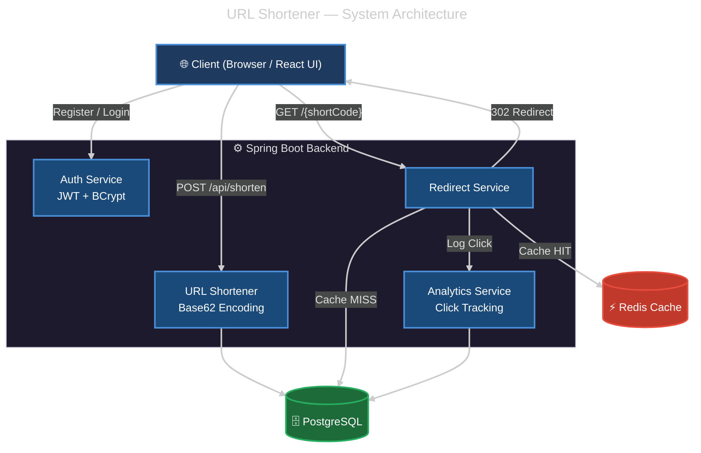

# 🚀 URL-Shortener

A production-ready full-stack URL shortener built with **React (Vite)**, **Spring Boot**, **PostgreSQL**, and **Redis**. It features JWT-based authentication, click analytics, and high-performance redirect routing powered by mathematically efficient Base62 encoding.

## 🏗️ System Architecture

When a user visits a short URL, the request is instantly handled by a multi-layer cache and persistent storage routing system:



### 🧠 The Math Behind the Magic: Base62 Encoding
How does a database row become a highly compact short URL without collision?
1. Every new URL mapped in PostgreSQL is assigned an auto-incremented Row ID (e.g., `125`, `3,521,614,606,208`).
2. That Base-10 integer is transformed into a **Base-62** string utilizing 62 characters (`0-9`, `a-z`, `A-Z`).
3. The result is completely deterministic, URL-safe, compact, and immune to string-clashing.

---

## 💻 Tech Stack

### Backend
* **Java 17 & Spring Boot 3**: Reliable, type-safe API controllers
* **PostgreSQL**: Relational persistent storage
* **Redis**: Sub-millisecond lookup cache preventing database bottleneck
* **Spring Security & JWT**: Request authorization and session management

### Frontend
* **React + Vite**: Ultra-fast component rendering and developer HMR
* **Tailwind CSS**: Utility-first scalable aesthetic design
* **Axios**: Network interfacing

---

## 🚀 How to Run Locally

### Prerequisites
* [Java 17+](https://adoptium.net/)
* [Node.js 18+](https://nodejs.org/)
* [PostgreSQL](https://www.postgresql.org/) (Running on `localhost:5432`)
* [Redis](https://redis.io/) (Running on `localhost:6379`)

### 1. Database Setup
Create an empty PostgreSQL database named `url_shortener`.

### 2. Backend Setup
Navigate into your Spring Boot application folder:
```bash
cd url-shortener-sb
```

Set up your local environment variables (or modify `src/main/resources/application.properties`):
```env
DATABASE_URL=jdbc:postgresql://localhost:5432/url_shortener
DATABASE_USERNAME=postgres
DATABASE_PASSWORD=your_postgres_password
REDIS_HOST=localhost
REDIS_PORT=6379
REDIS_PASSWORD=your_redis_password
```

Compile and run the Spring Boot API:
```bash
./mvnw clean install
./mvnw spring-boot:run
```
*(The backend runs on `http://localhost:8080`)*

### 3. Frontend Setup
Navigate into your React UI folder:
```bash
cd url-shortener-ui
```

Make sure your UI knows where your backend is. In `.env.development`:
```env
VITE_BACKEND_URL=http://localhost:8080
```

Install modules and start Vite:
```bash
npm install
npm run dev
```
*(The frontend runs on `http://localhost:5173`)*

---

*Built for high performance and learning in public.*
