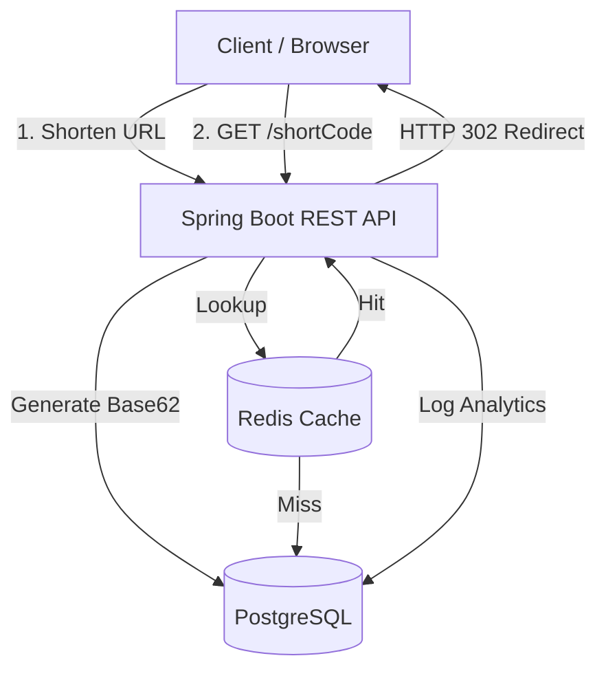

# 🔗 Production-Grade URL Shortener 

A scalable, production-ready distributed URL shortener backend built with **Java 21, Spring Boot, PostgreSQL, and Redis**. 

---

## 🏗️ Architecture



---

## 🚀 How to Run Locally

You can spin up the entire application (PostgreSQL + Redis + App) using Docker Compose.

### Requirements:
- Docker & Docker Compose installed

### Start the App:
```bash
docker-compose up -d --build
```
*The app will be live at `http://localhost:8080`*

---

## 📡 API Endpoints

| Method | Endpoint | Auth Required | Description |
|--------|---------|--------------|-------------|
| `POST` | `/api/auth/register` | ❌ | Create a new user account |
| `POST` | `/api/auth/login` | ❌ | Login and receive a JWT token |
| `POST` | `/api/shorten` | ❌ | Shorten a long URL |
| `GET`  | `/{shortCode}` | ❌ | Redirects to the original URL (HTTP 302) |
| `GET`  | `/api/analytics/{code}` | ✅ | View click count and analytics |

---

## 🛠️ Technology Stack
- **Backend:** Java 21, Spring Boot 3
- **Database:** PostgreSQL
- **Caching:** Redis 
- **Security:** Spring Security + JWT Auth
- **Validation:** Spring Boot Validation 
